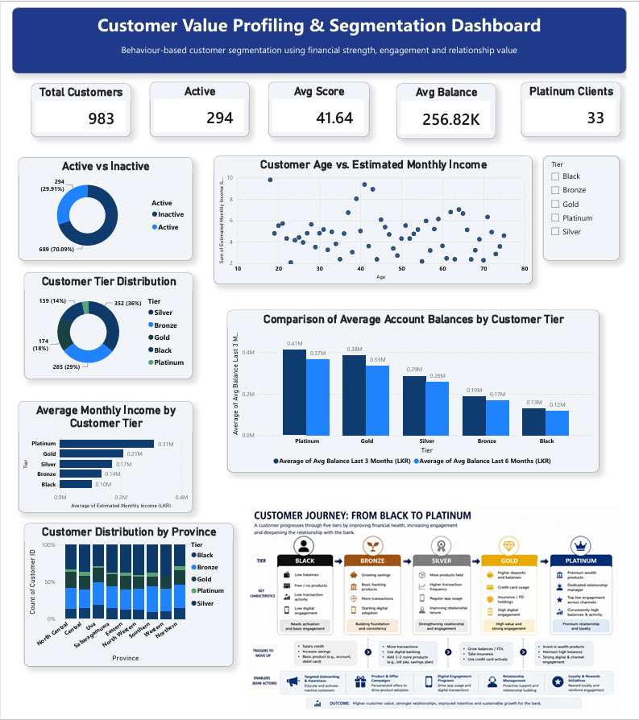
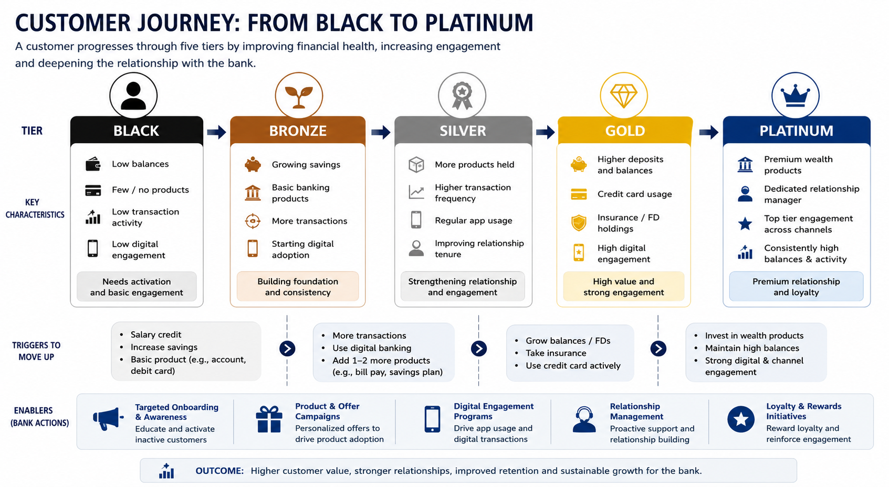

# 📊 Customer Profiling and Value Segmentation Analysis

## 📌 Project Overview

This project develops a customer profiling and value segmentation framework for a banking customer base by transforming customer behaviour, financial attributes, product ownership, and engagement data into actionable business insights.

A transparent weighted scoring model was developed to classify customers into five value segments:

- 💎 Platinum
- 🥇 Gold
- 🥈 Silver
- 🥉 Bronze
- ⚫ Black

The analysis helps identify high-value customers, growth opportunities, retention risks, and targeted strategies to improve customer lifetime value.

---

# 🎯 Business Problem

Banks serve customers with different levels of financial value and engagement. Traditional segmentation methods may not provide clear business actions.

This analysis aims to answer:

- Who are the most valuable customers?
- Which customers have potential to grow?
- Which customers require retention actions?
- How can marketing strategies be personalized?

The framework supports:

✅ Customer retention  
✅ Cross-selling opportunities  
✅ Targeted marketing campaigns  
✅ Relationship management  
✅ Customer value optimization  

---

# 📂 Dataset & Data Preparation

## Dataset Overview

The dataset contained **1,006 customer records** covering:

- Customer demographics
- Financial behaviour
- Product ownership
- Transaction activity
- Digital engagement

## Data Preparation Activities

The dataset was cleaned and validated through:

| Activity | Purpose |
|---|---|
| Duplicate removal | Prevent double counting |
| Invalid value removal | Improve data quality |
| Missing value treatment | Maintain complete analysis |
| Category standardization | Ensure consistency |

After data preparation, the dataset was suitable for customer profiling and segmentation.

---

# 📈 Customer Scoring Framework

Instead of using complex clustering techniques, a business-friendly weighted scoring model was developed.

Customers were evaluated across five dimensions:

| Dimension | Weight | Key Variables |
|---|---|---|
| Financial Strength | 35% | Income, Savings Balance, Average Balance |
| Transaction Behaviour | 25% | Monthly Transactions, Transaction Days |
| Product Ownership | 20% | Number of Products Held |
| Digital Engagement | 10% | Mobile App Usage |
| Relationship History | 10% | Customer Tenure |

Customer scores were calculated using normalized variables:

---

# 🏷️ Customer Segmentation Results

Customers were classified into five value tiers:

| Tier | Score Range | Customer Profile |
|---|---|---|
| 💎 Platinum | ≥60 | High-value customers with strong financial and engagement levels |
| 🥇 Gold | 50–59 | Strong customers with Platinum potential |
| 🥈 Silver | 40–49 | Moderate customers with cross-selling opportunities |
| 🥉 Bronze | 30–39 | Growth opportunity segment |
| ⚫ Black | <30 | Low engagement customers |

---

# 🔍 Key Insights

### 💎 Platinum Customers
- Maintain the highest balances and income levels
- Own more banking products
- Show strong transaction activity and digital engagement

### 🥇 Gold Customers
- Represent the strongest upgrade opportunity
- Can be moved towards Platinum through targeted wealth solutions

### 🥈 Silver Customers
- Provide significant cross-selling opportunities

### 🥉 Bronze Customers
- Require digital adoption and engagement improvement

### ⚫ Black Customers
- Represent customer activation opportunities

---

# 📊 Dashboard Preview

Interactive Power BI dashboard developed to analyze:

## 📊 Dashboard Preview

---

## 📈 Interactive Dashboard

🔗 **Power BI Dashboard:**  
*[Customer _Segmentation Analysis_Dash_Board.pbit](https://github.com/ishani-k312/Customer-Profiling-and-Value-Segmentation/blob/main/Customer%20_egmentation%20Analysis_Dash_Board.pbit)*

---

## 📂 Project Files

- 📓 Customer Profiling Analysis Notebook (*[Customer _Segmentation Analysis_Python_Code.ipynb](https://github.com/ishani-k312/Customer-Profiling-and-Value-Segmentation/blob/main/Customer%20_egmentation%20Analysis_Python_Code.ipynb)*)
-  📄 Project Report (*[Customer _Segmentation Analysis_Final_Report.pdf](https://github.com/ishani-k312/Customer-Profiling-and-Value-Segmentation/blob/main/Customer%20_egmentation%20Analysis_Final_Report.pdf)*)
- 📊 Power BI Dashboard (PDF) (*[Customer _Segmentation Analysis_Dash_Board.pdf](https://github.com/ishani-k312/Customer-Profiling-and-Value-Segmentation/blob/main/Customer%20_egmentation%20Analysis_Dash_Board.pdf)*)

---

## 💡 Key Highlights

- Cleaned and prepared customer data for analysis.
- Performed exploratory data analysis to understand customer behaviour.
- Built a weighted customer scoring model using financial and behavioural metrics.
- Segmented customers into five business value tiers: Platinum, Gold, Silver, Bronze, and Black.
- Designed an interactive Power BI dashboard to visualize customer insights and support business decision-making.

---
## 💡 Strategic Recommendations

Based on customer segmentation results, the following targeted strategies are recommended:

  

*Figure: Recommended customer strategies based on value segments*

## ⚠️ Note

The original dataset is not included in this repository because it is based on a real-world banking scenario and contains confidential information.

---

## 👩‍💻 Author

**Ishani Kodithuwakku**

Data Analyst

🔗 LinkedIn: www.linkedin.com/in/ishani-kodithuwakku-275b29220

